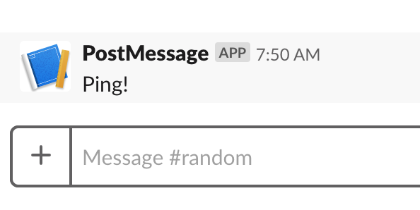
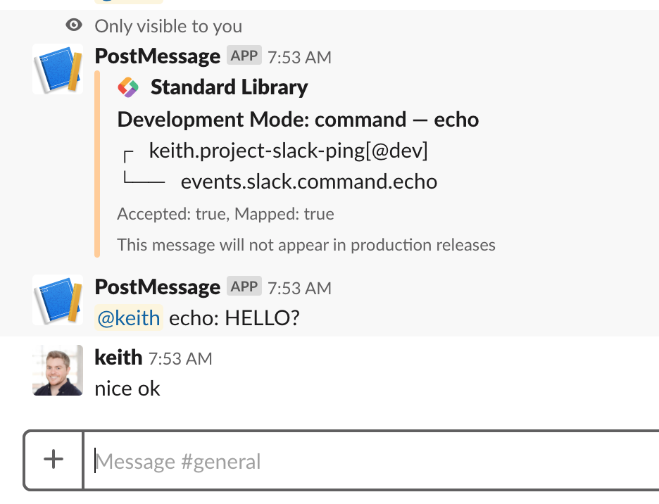
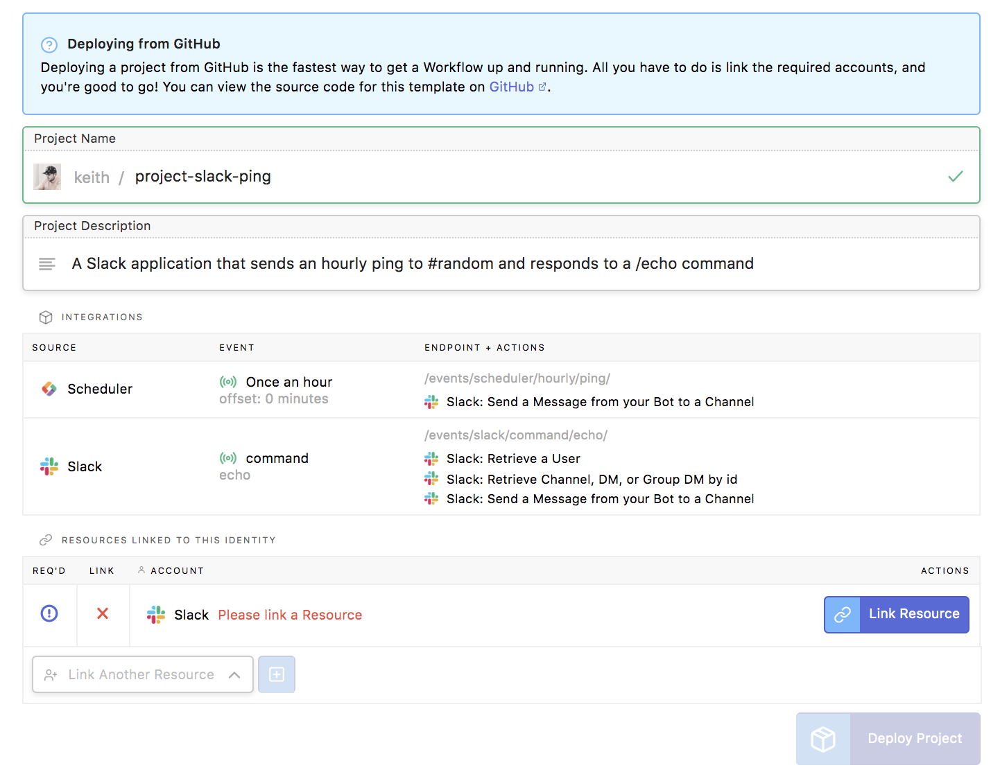

# Basic Slack App: Scheduled ping, /echo command

This is a basic Slack Application example, written in Node.js,
on [Standard Library](https://stdlib.com) that:

1. Creates an hourly scheduled event to send the message "Ping!" to `#random`.

2. Creates an `/echo` command that sends the message `<@user> said: (text)` to the channel it was invoked from.

You can deploy it *instantly* to Slack without writing any code or configuring
any files due to Standard Library's [Identity Token](https://docs.stdlib.com/identity-management-sso-for-apis/what-is-an-identity-token/) support. You'll be walked through setting up the Slack app
as part of the configuration process.

**NOTE:** You will still need to create
the `/echo` command separately, once deployed, that needs to point to:
`https://<username>.events.stdlib.com/`.

# Hourly Ping Event

This event will trigger `/functions/events/scheduler/hourly/ping.js` and provide
an output that look like this:

# Echo Command

This event will trigger `/functions/events/slack/command/echo.js` and provide
an output that looks like this (the debug message will only appear in `development`):

# Deploying this Slack App

You can deploy this Slack App to [Standard Library](https://stdlib.com) by clicking this button:

You'll be asked to log in and be brought to a screen that looks something like this:

Simply click **Link Resource** and follow the instructions to build and link
a Slack app, then click **Deploy Project** when ready.

Once deployed, you'll need to configure the Slack slash command in your Slack app
dashboard: create an `/echo` command that points to:
`https://<username>.events.stdlib.com/`.

That's it!

# Thank You!

Please check out [Standard Library](https://stdlib.com/) or follow us on Twitter,
[@StdLibHQ](https://twitter.com/@StdLibHQ).
